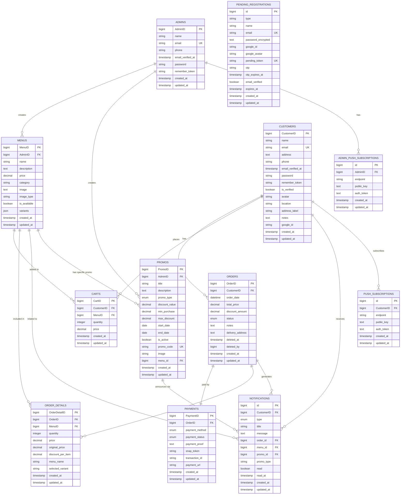
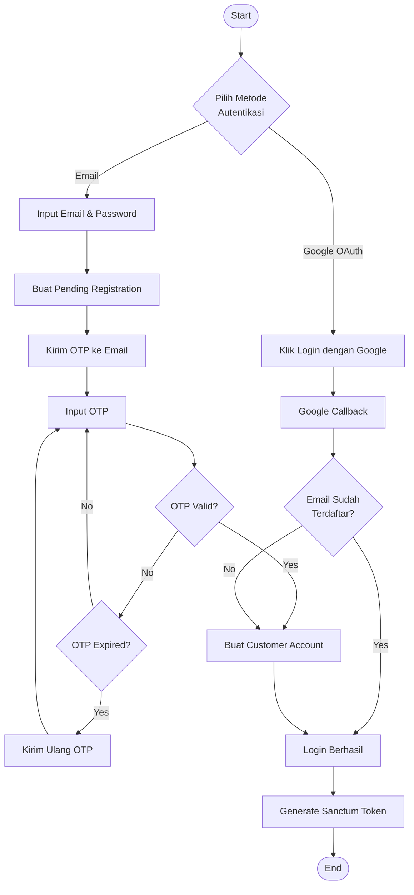
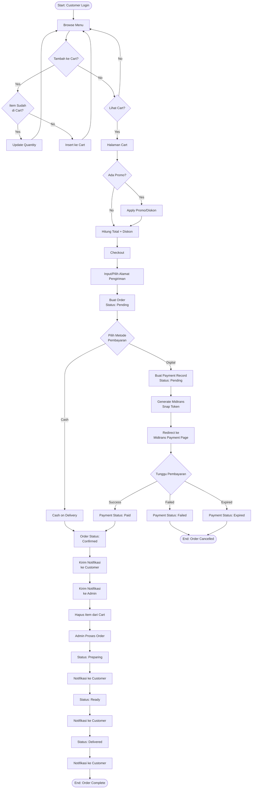
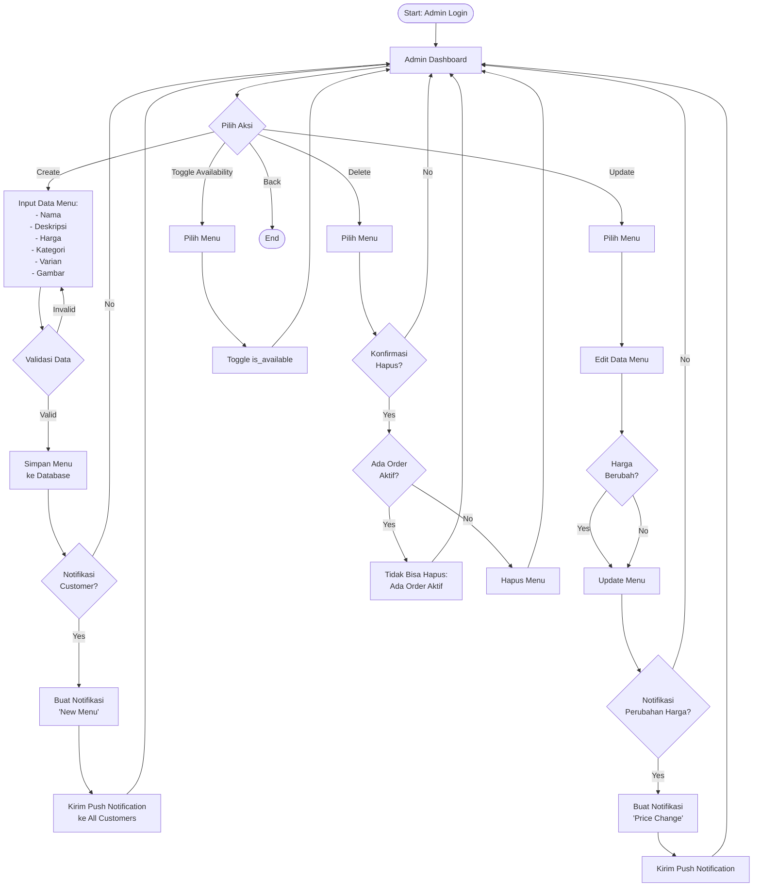
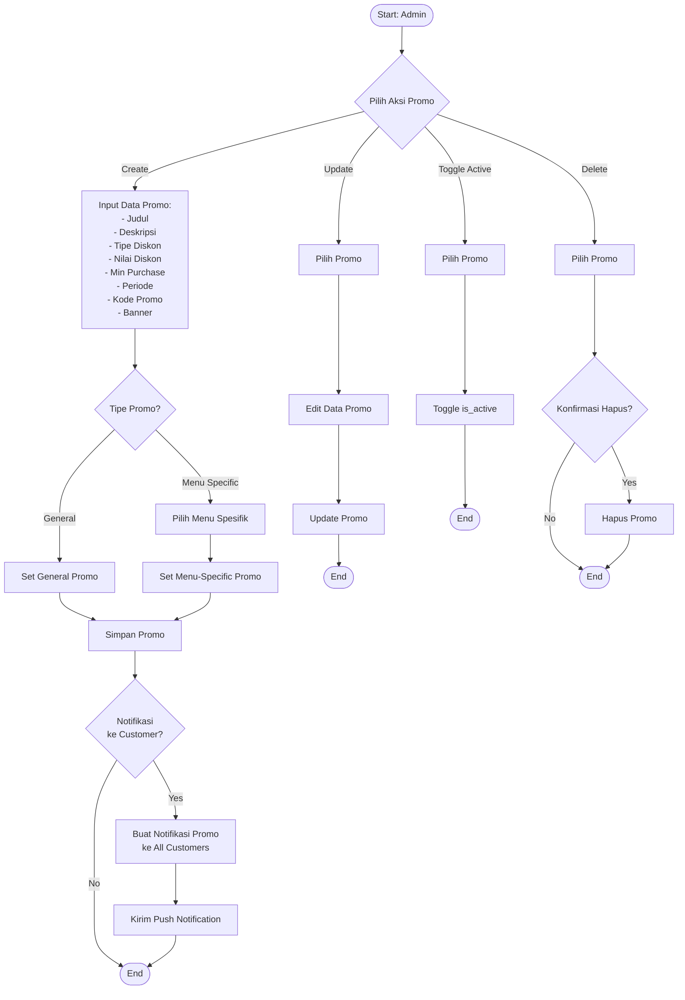
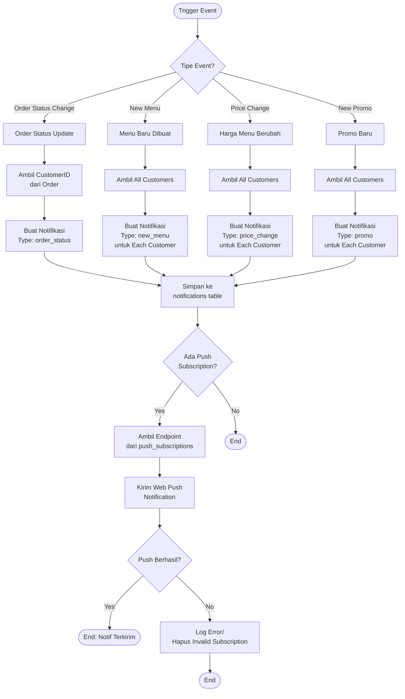
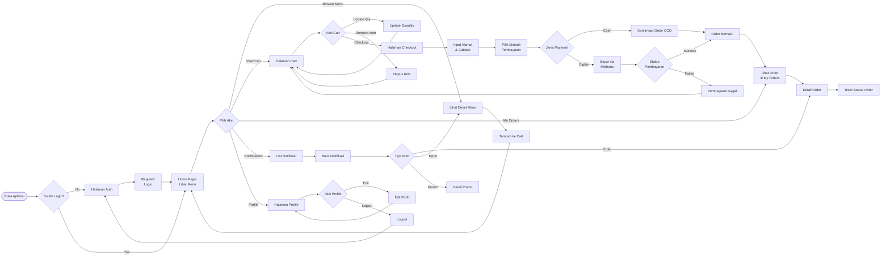
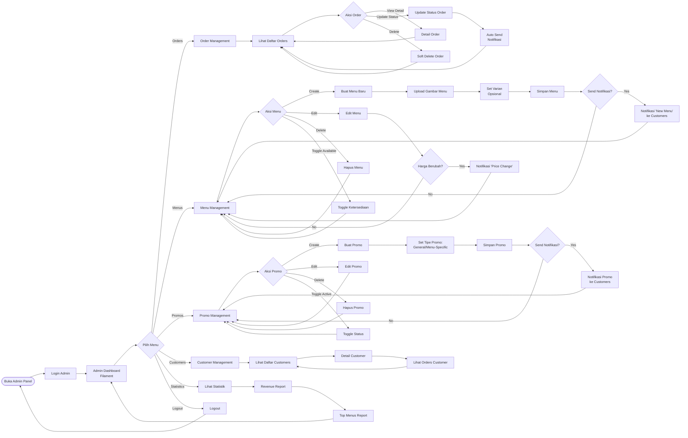

# Dokumentasi Project Food Delivery System

## Daftar Isi
1. [Entity Relationship Diagram (ERD)](#entity-relationship-diagram-erd)
2. [Flowchart](#flowchart)
3. [User Flow](#user-flow)
4. [Use Case](#use-case)

---

## Entity Relationship Diagram (ERD)

### Diagram Visual ERD

### Daftar Entitas dan Atribut

#### 1. **Admins**
Entitas yang merepresentasikan administrator sistem.

**Atribut:**
- `AdminID` (PK) - ID unik admin
- `name` - Nama admin
- `email` - Email admin (unique)
- `phone` - Nomor telepon
- `email_verified_at` - Timestamp verifikasi email
- `password` - Password terenkripsi
- `remember_token` - Token untuk "remember me"
- `created_at`, `updated_at` - Timestamps

#### 2. **Customers**
Entitas yang merepresentasikan pelanggan/pengguna aplikasi.

**Atribut:**
- `CustomerID` (PK) - ID unik customer
- `name` - Nama customer
- `email` - Email customer (unique)
- `address` - Alamat lengkap
- `phone` - Nomor telepon
- `email_verified_at` - Timestamp verifikasi email
- `password` - Password terenkripsi
- `remember_token` - Token untuk "remember me"
- `is_verified` - Status verifikasi akun
- `avatar` - URL/path foto profil
- `location` - Koordinat lokasi (latitude, longitude)
- `address_label` - Label alamat (Rumah, Kantor, dll)
- `notes` - Catatan tambahan alamat
- `google_id` - ID untuk Google OAuth
- `created_at`, `updated_at` - Timestamps

#### 3. **Menus**
Entitas yang merepresentasikan menu makanan/minuman.

**Atribut:**
- `MenuID` (PK) - ID unik menu
- `AdminID` (FK) - Foreign key ke Admins
- `name` - Nama menu
- `description` - Deskripsi menu
- `price` - Harga menu
- `category` - Kategori menu (main, appetizer, dessert, drink)
- `image` - Path gambar menu
- `image_type` - Tipe file gambar
- `is_available` - Status ketersediaan menu
- `variants` - JSON array varian menu (misal: Goreng, Kuah)
- `created_at`, `updated_at` - Timestamps

#### 4. **Orders**
Entitas yang merepresentasikan pesanan pelanggan.

**Atribut:**
- `OrderID` (PK) - ID unik order
- `CustomerID` (FK) - Foreign key ke Customers
- `order_date` - Tanggal dan waktu order
- `total_price` - Total harga pesanan
- `discount_amount` - Jumlah diskon yang diberikan
- `status` - Status pesanan (pending, confirmed, preparing, ready, delivered, cancelled, completed)
- `notes` - Catatan pesanan
- `delivery_address` - Alamat pengiriman
- `deleted_at` - Soft delete timestamp
- `deleted_by` - ID yang menghapus order
- `created_at`, `updated_at` - Timestamps

#### 5. **Order_Details**
Entitas detail item dalam setiap pesanan (relasi many-to-many antara Orders dan Menus).

**Atribut:**
- `OrderDetailID` (PK) - ID unik order detail
- `OrderID` (FK) - Foreign key ke Orders
- `MenuID` (FK) - Foreign key ke Menus
- `quantity` - Jumlah item
- `price` - Harga after discount
- `original_price` - Harga asli sebelum diskon
- `discount_per_item` - Diskon per item
- `menu_name` - Nama menu (snapshot)
- `selected_variant` - Varian yang dipilih
- `created_at`, `updated_at` - Timestamps

#### 6. **Payments**
Entitas yang merepresentasikan pembayaran untuk pesanan.

**Atribut:**
- `PaymentID` (PK) - ID unik payment
- `OrderID` (FK) - Foreign key ke Orders
- `payment_method` - Metode pembayaran (cash, bank_transfer, qris, e-wallet)
- `payment_status` - Status pembayaran (pending, paid, expired, failed, refunded)
- `payment_proof` - Bukti pembayaran
- `snap_token` - Token Midtrans Snap
- `transaction_id` - ID transaksi Midtrans
- `payment_url` - URL pembayaran Midtrans
- `created_at`, `updated_at` - Timestamps

#### 7. **Carts**
Entitas yang merepresentasikan keranjang belanja pelanggan.

**Atribut:**
- `CartID` (PK) - ID unik cart
- `CustomerID` (FK) - Foreign key ke Customers
- `MenuID` (FK) - Foreign key ke Menus
- `quantity` - Jumlah item
- `price` - Harga item
- `created_at`, `updated_at` - Timestamps
- **Constraint:** Unique combination (CustomerID, MenuID) - satu customer tidak bisa punya item menu yang sama di cart

#### 8. **Notifications**
Entitas yang merepresentasikan notifikasi ke pelanggan.

**Atribut:**
- `id` (PK) - ID unik notifikasi
- `CustomerID` (FK) - Foreign key ke Customers
- `type` - Tipe notifikasi (order_status, price_change, new_menu, promo)
- `title` - Judul notifikasi
- `message` - Isi pesan notifikasi
- `order_id` (FK) - Foreign key ke Orders (nullable)
- `menu_id` (FK) - Foreign key ke Menus (nullable)
- `promo_id` (FK) - Foreign key ke Promos (nullable)
- `promo_type` - Tipe promo (nullable)
- `read` - Status dibaca (boolean)
- `read_at` - Timestamp dibaca
- `created_at`, `updated_at` - Timestamps

#### 9. **Promos**
Entitas yang merepresentasikan promosi/diskon.

**Atribut:**
- `PromoID` (PK) - ID unik promo
- `AdminID` (FK) - Foreign key ke Admins
- `title` - Judul promo
- `description` - Deskripsi promo
- `promo_type` - Tipe diskon (percentage, fixed, menu_specific)
- `discount_value` - Nilai diskon (% atau Rp)
- `min_purchase` - Minimal pembelian
- `max_discount` - Maksimal diskon
- `start_date` - Tanggal mulai
- `end_date` - Tanggal berakhir
- `is_active` - Status aktif promo
- `promo_code` - Kode promo (unique, nullable)
- `image` - Banner promo
- `menu_id` (FK) - Foreign key ke Menus (untuk promo spesifik menu)
- `created_at`, `updated_at` - Timestamps

#### 10. **Push_Subscriptions**
Entitas untuk menyimpan subscription push notification customer.

**Atribut:**
- `id` (PK) - ID unik subscription
- `CustomerID` (FK) - Foreign key ke Customers
- `endpoint` - Endpoint push notification
- `public_key` - Public key untuk enkripsi
- `auth_token` - Auth token untuk push
- `created_at`, `updated_at` - Timestamps

#### 11. **Admin_Push_Subscriptions**
Entitas untuk menyimpan subscription push notification admin.

**Atribut:**
- `id` (PK) - ID unik subscription
- `AdminID` (FK) - Foreign key ke Admins
- `endpoint` - Endpoint push notification
- `public_key` - Public key untuk enkripsi
- `auth_token` - Auth token untuk push
- `created_at`, `updated_at` - Timestamps

#### 12. **Pending_Registrations**
Entitas untuk menyimpan data registrasi sementara sebelum verifikasi email.

**Atribut:**
- `id` (PK) - ID unik pending registration
- `type` - Tipe registrasi (email, google)
- `name` - Nama user
- `email` - Email user (unique)
- `password_encrypted` - Password terenkripsi reversibel
- `google_id` - ID Google OAuth (nullable)
- `google_avatar` - Avatar dari Google (nullable)
- `pending_token` - Token untuk sesi pending (unique)
- `otp` - Kode OTP 6 digit
- `otp_expires_at` - Waktu expire OTP
- `email_verified` - Status verifikasi email
- `expires_at` - Waktu expire sesi (24 jam)
- `created_at`, `updated_at` - Timestamps

---

### Relasi Antar Entitas

#### 1. **Admins ↔ Menus**
- **Relasi:** One-to-Many (1:N)
- **Deskripsi:** Satu admin dapat mengelola banyak menu
- **Foreign Key:** `Menus.AdminID` references `Admins.AdminID`
- **On Delete:** CASCADE (jika admin dihapus, menu-nya ikut terhapus)

#### 2. **Admins ↔ Promos**
- **Relasi:** One-to-Many (1:N)
- **Deskripsi:** Satu admin dapat membuat banyak promo
- **Foreign Key:** `Promos.AdminID` references `Admins.AdminID`
- **On Delete:** CASCADE

#### 3. **Admins ↔ Admin_Push_Subscriptions**
- **Relasi:** One-to-Many (1:N)
- **Deskripsi:** Satu admin dapat memiliki banyak subscription push notification
- **Foreign Key:** `Admin_Push_Subscriptions.AdminID` references `Admins.AdminID`
- **On Delete:** CASCADE

#### 4. **Customers ↔ Orders**
- **Relasi:** One-to-Many (1:N)
- **Deskripsi:** Satu customer dapat membuat banyak order
- **Foreign Key:** `Orders.CustomerID` references `Customers.CustomerID`
- **On Delete:** CASCADE

#### 5. **Customers ↔ Carts**
- **Relasi:** One-to-Many (1:N)
- **Deskripsi:** Satu customer dapat memiliki banyak item di cart
- **Foreign Key:** `Carts.CustomerID` references `Customers.CustomerID`
- **On Delete:** CASCADE

#### 6. **Customers ↔ Notifications**
- **Relasi:** One-to-Many (1:N)
- **Deskripsi:** Satu customer dapat menerima banyak notifikasi
- **Foreign Key:** `Notifications.CustomerID` references `Customers.CustomerID`
- **On Delete:** CASCADE

#### 7. **Customers ↔ Push_Subscriptions**
- **Relasi:** One-to-Many (1:N)
- **Deskripsi:** Satu customer dapat memiliki banyak subscription push notification
- **Foreign Key:** `Push_Subscriptions.CustomerID` references `Customers.CustomerID`
- **On Delete:** CASCADE

#### 8. **Menus ↔ Carts**
- **Relasi:** One-to-Many (1:N)
- **Deskripsi:** Satu menu dapat ditambahkan ke banyak cart
- **Foreign Key:** `Carts.MenuID` references `Menus.MenuID`
- **On Delete:** CASCADE

#### 9. **Menus ↔ Order_Details**
- **Relasi:** One-to-Many (1:N)
- **Deskripsi:** Satu menu dapat muncul di banyak order detail
- **Foreign Key:** `Order_Details.MenuID` references `Menus.MenuID`
- **On Delete:** CASCADE

#### 10. **Menus ↔ Notifications**
- **Relasi:** One-to-Many (1:N)
- **Deskripsi:** Satu menu dapat terkait dengan banyak notifikasi
- **Foreign Key:** `Notifications.menu_id` references `Menus.MenuID`
- **On Delete:** CASCADE

#### 11. **Menus ↔ Promos**
- **Relasi:** One-to-Many (1:N)
- **Deskripsi:** Satu menu dapat memiliki banyak promo spesifik
- **Foreign Key:** `Promos.menu_id` references `Menus.MenuID`
- **On Delete:** CASCADE (optional untuk promo menu-specific)

#### 12. **Orders ↔ Order_Details**
- **Relasi:** One-to-Many (1:N)
- **Deskripsi:** Satu order dapat memiliki banyak item (order details)
- **Foreign Key:** `Order_Details.OrderID` references `Orders.OrderID`
- **On Delete:** CASCADE

#### 13. **Orders ↔ Payments**
- **Relasi:** One-to-One (1:1)
- **Deskripsi:** Satu order memiliki satu payment
- **Foreign Key:** `Payments.OrderID` references `Orders.OrderID`
- **On Delete:** CASCADE

#### 14. **Orders ↔ Notifications**
- **Relasi:** One-to-Many (1:N)
- **Deskripsi:** Satu order dapat menghasilkan banyak notifikasi
- **Foreign Key:** `Notifications.order_id` references `Orders.OrderID`
- **On Delete:** CASCADE

#### 15. **Promos ↔ Notifications**
- **Relasi:** One-to-Many (1:N)
- **Deskripsi:** Satu promo dapat menghasilkan banyak notifikasi
- **Foreign Key:** `Notifications.promo_id` references `Promos.PromoID`
- **On Delete:** CASCADE

---

## Flowchart

### 1. Customer Registration & Login Flow

### 2. Order Processing Flow

### 3. Admin Menu Management Flow

### 4. Promo Management Flow

### 5. Notification System Flow

---

## User Flow

### 1. Customer User Flow

### 2. Admin User Flow

---

## Use Case

### Use Case Diagram

```mermaid
graph TB
    subgraph System["Food Delivery System"]
        subgraph CustomerUC["Customer Use Cases"]
            UC1[Register & Login]
            UC2[Browse Menu]
            UC3[Add to Cart]
            UC4[Manage Cart]
            UC5[Checkout & Order]
            UC6[Choose Payment Method]
            UC7[Process Payment]
            UC8[Track Order]
            UC9[View Order History]
            UC10[Receive Notifications]
            UC11[Manage Profile]
            UC12[Enable Push Notifications]
            UC13[View Promos]
        end
        
        subgraph AdminUC["Admin Use Cases"]
            UC14[Admin Login]
            UC15[Manage Menus]
            UC16[Create Menu]
            UC17[Update Menu]
            UC18[Delete Menu]
            UC19[Manage Orders]
            UC20[Update Order Status]
            UC21[View Order Details]
            UC22[Manage Promos]
            UC23[Create Promo]
            UC24[Update Promo]
            UC25[Delete Promo]
            UC26[View Customers]
            UC27[Send Notifications]
            UC28[View Statistics]
        end
        
        subgraph SystemUC["System Use Cases"]
            UC29[Send Push Notification]
            UC30[Process Payment Gateway]
            UC31[Auto Send Email OTP]
            UC32[Calculate Discount]
            UC33[Validate Promo]
        end
    end
    
    Customer((Customer))
    Admin((Admin))
    MidtransAPI[Midtrans<br/>Payment Gateway]
    EmailService[Email<br/>Service]
    PushService[Push<br/>Notification<br/>Service]
    
    Customer --> UC1
    Customer --> UC2
    Customer --> UC3
    Customer --> UC4
    Customer --> UC5
    Customer --> UC6
    Customer --> UC7
    Customer --> UC8
    Customer --> UC9
    Customer --> UC10
    Customer --> UC11
    Customer --> UC12
    Customer --> UC13
    
    Admin --> UC14
    Admin --> UC15
    Admin --> UC19
    Admin --> UC22
    Admin --> UC26
    Admin --> UC27
    Admin --> UC28
    
    UC15 --> UC16
    UC15 --> UC17
    UC15 --> UC18
    
    UC19 --> UC20
    UC19 --> UC21
    
    UC22 --> UC23
    UC22 --> UC24
    UC22 --> UC25
    
    UC1 -.->|includes| UC31
    UC5 -.->|includes| UC32
    UC5 -.->|includes| UC33
    UC7 -.->|uses| UC30
    UC10 -.->|includes| UC29
    UC20 -.->|triggers| UC29
    UC16 -.->|triggers| UC29
    UC17 -.->|triggers| UC29
    UC23 -.->|triggers| UC29
    
    UC30 -.->|external| MidtransAPI
    UC31 -.->|external| EmailService
    UC29 -.->|external| PushService
```

### Detailed Use Case Descriptions

#### **1. Customer Use Cases**

##### UC1: Register & Login
- **Aktor:** Customer (Belum Login)
- **Deskripsi:** Customer mendaftar akun baru atau login ke aplikasi
- **Precondition:** Customer belum memiliki akun atau sudah memiliki akun
- **Flow:**
  1. Customer memilih metode registrasi (Email atau Google OAuth)
  2. **Jika Email:** Input email dan password → Sistem kirim OTP → Verifikasi OTP → Akun dibuat
  3. **Jika Google:** Login via Google → Sistem ambil data dari Google → Akun dibuat otomatis
  4. Sistem generate Sanctum token untuk autentikasi
  5. Customer berhasil login
- **Postcondition:** Customer ter-autentikasi dan dapat mengakses aplikasi

##### UC2: Browse Menu
- **Aktor:** Customer
- **Deskripsi:** Customer melihat daftar menu yang tersedia
- **Precondition:** Customer sudah login
- **Flow:**
  1. Customer masuk ke halaman home
  2. Sistem menampilkan daftar menu yang is_available = true
  3. Customer dapat filter berdasarkan kategori (main, appetizer, dessert, drink)
  4. Customer dapat search menu by name
- **Postcondition:** Menu ditampilkan ke customer

##### UC3: Add to Cart
- **Aktor:** Customer
- **Deskripsi:** Customer menambahkan menu ke keranjang belanja
- **Precondition:** Customer sudah login dan melihat detail menu
- **Flow:**
  1. Customer pilih menu
  2. Customer pilih varian (jika ada)
  3. Customer set quantity
  4. Customer klik "Add to Cart"
  5. Sistem cek jika menu sudah ada di cart
  6. **Jika sudah ada:** Update quantity
  7. **Jika belum ada:** Insert cart item baru
- **Postcondition:** Item ditambahkan/diupdate di cart

##### UC4: Manage Cart
- **Aktor:** Customer
- **Deskripsi:** Customer mengelola isi keranjang belanja
- **Precondition:** Cart memiliki minimal 1 item
- **Flow:**
  1. Customer buka halaman cart
  2. Sistem tampilkan semua items di cart
  3. Customer dapat:
     - Update quantity item
     - Hapus item dari cart
     - Lihat subtotal per item dan total keseluruhan
- **Postcondition:** Cart ter-update sesuai aksi customer

##### UC5: Checkout & Order
- **Aktor:** Customer
- **Deskripsi:** Customer melakukan checkout dan membuat order
- **Precondition:** Cart memiliki minimal 1 item
- **Flow:**
  1. Customer klik "Checkout"
  2. Sistem tampilkan summary order
  3. Customer input/pilih alamat pengiriman
  4. Customer input catatan order (optional)
  5. Sistem cek promo yang tersedia dan apply discount
  6. Sistem hitung total + discount
  7. Customer pilih metode pembayaran
  8. Sistem buat order dengan status "pending"
  9. Sistem buat payment record
- **Postcondition:** Order dan payment record dibuat

##### UC6: Choose Payment Method
- **Aktor:** Customer
- **Deskripsi:** Customer memilih metode pembayaran
- **Precondition:** Order sudah dibuat
- **Flow:**
  1. Sistem tampilkan opsi payment method:
     - Cash on Delivery (COD)
     - Bank Transfer (Midtrans)
     - QRIS (Midtrans)
     - E-Wallet (Midtrans)
  2. Customer pilih metode
  3. **Jika COD:** Order langsung confirmed
  4. **Jika Digital:** Lanjut ke UC7 (Process Payment)
- **Postcondition:** Payment method terpilih

##### UC7: Process Payment
- **Aktor:** Customer, Midtrans Payment Gateway
- **Deskripsi:** Customer melakukan pembayaran via Midtrans
- **Precondition:** Customer pilih metode pembayaran digital
- **Flow:**
  1. Sistem generate Midtrans Snap Token
  2. Sistem simpan snap_token ke payment record
  3. Customer di-redirect ke Midtrans payment page
  4. Customer selesaikan pembayaran di Midtrans
  5. Midtrans kirim callback ke sistem
  6. Sistem update payment_status:
     - **Success:** payment_status = 'paid', order status = 'confirmed'
     - **Failed:** payment_status = 'failed'
     - **Expired:** payment_status = 'expired'
  7. Sistem kirim notifikasi ke customer dan admin
  8. Sistem hapus items dari cart
- **Postcondition:** Order ter-konfirmasi atau gagal

##### UC8: Track Order
- **Aktor:** Customer
- **Deskripsi:** Customer melacak status pesanan
- **Precondition:** Customer memiliki order aktif
- **Flow:**
  1. Customer buka "My Orders"
  2. Sistem tampilkan daftar orders
  3. Customer pilih order untuk detail
  4. Sistem tampilkan:
     - Order details (items, quantity, price)
     - Current status (pending/confirmed/preparing/ready/delivered)
     - Delivery address
     - Payment info
  5. Customer terima notifikasi real-time jika status berubah
- **Postcondition:** Customer mengetahui status order

##### UC9: View Order History
- **Aktor:** Customer
- **Deskripsi:** Customer melihat riwayat pesanan
- **Precondition:** Customer sudah pernah order
- **Flow:**
  1. Customer buka "Order History"
  2. Sistem tampilkan semua orders (completed, cancelled)
  3. Customer dapat filter by status atau tanggal
  4. Customer dapat view detail order
- **Postcondition:** Order history ditampilkan

##### UC10: Receive Notifications
- **Aktor:** Customer
- **Deskripsi:** Customer menerima notifikasi
- **Precondition:** Ada event yang trigger notifikasi
- **Flow:**
  1. System event terjadi (order status change, new menu, price change, promo)
  2. Sistem buat notification record
  3. Sistem kirim web push notification (jika ada subscription)
  4. Customer terima notifikasi
  5. Customer buka notifikasi
  6. Sistem tandai notifikasi sebagai read
  7. Customer di-redirect sesuai tipe notifikasi
- **Postcondition:** Customer menerima dan membaca notifikasi

##### UC11: Manage Profile
- **Aktor:** Customer
- **Deskripsi:** Customer mengelola profil
- **Precondition:** Customer sudah login
- **Flow:**
  1. Customer buka halaman profile
  2. Customer dapat edit:
     - Name
     - Email
     - Phone
     - Address
     - Address label & notes
     - Avatar
     - Location
  3. Customer save changes
  4. Sistem validasi dan update data
- **Postcondition:** Profile ter-update

##### UC12: Enable Push Notifications
- **Aktor:** Customer
- **Deskripsi:** Customer mengaktifkan push notification
- **Precondition:** Customer sudah login dan browser support push
- **Flow:**
  1. Customer klik "Enable Notifications"
  2. Browser request permission
  3. Customer terima permission
  4. Sistem generate subscription (endpoint, keys)
  5. Sistem simpan ke push_subscriptions table
- **Postcondition:** Push notification aktif untuk customer

##### UC13: View Promos
- **Aktor:** Customer
- **Deskripsi:** Customer melihat promo yang tersedia
- **Precondition:** Ada promo aktif
- **Flow:**
  1. Customer buka halaman promo/notifikasi promo
  2. Sistem tampilkan promo yang is_active = true dan dalam periode valid
  3. Customer lihat detail promo (discount, min purchase, expired date)
  4. Promo otomatis ter-apply saat checkout (jika memenuhi syarat)
- **Postcondition:** Customer mengetahui promo available

---

#### **2. Admin Use Cases**

##### UC14: Admin Login
- **Aktor:** Admin
- **Deskripsi:** Admin login ke panel admin
- **Precondition:** Admin memiliki akun
- **Flow:**
  1. Admin masukkan email dan password
  2. Sistem validasi credentials
  3. Sistem generate session/token
  4. Admin berhasil login ke Filament panel
- **Postcondition:** Admin ter-autentikasi

##### UC15: Manage Menus
- **Aktor:** Admin
- **Deskripsi:** Admin mengelola menu (parent use case)
- **Includes:** UC16 (Create), UC17 (Update), UC18 (Delete)

##### UC16: Create Menu
- **Aktor:** Admin
- **Deskripsi:** Admin membuat menu baru
- **Precondition:** Admin sudah login
- **Flow:**
  1. Admin klik "Create Menu"
  2. Admin input data:
     - Name
     - Description
     - Price
     - Category
     - Upload image
     - Set variants (optional)
     - is_available
  3. Sistem validasi data
  4. Sistem simpan menu (AdminID = current admin)
  5. **Optional:** Admin pilih kirim notifikasi
  6. Sistem buat notifikasi "new_menu" ke all customers
  7. Sistem kirim push notification
- **Postcondition:** Menu baru dibuat dan customer dapat notifikasi

##### UC17: Update Menu
- **Aktor:** Admin
- **Deskripsi:** Admin update menu existing
- **Precondition:** Menu sudah ada
- **Flow:**
  1. Admin pilih menu
  2. Admin edit data (name, description, price, dll)
  3. Sistem cek jika price berubah
  4. **Jika price berubah:** 
     - Admin konfirmasi kirim notifikasi
     - Sistem buat notifikasi "price_change"
     - Sistem kirim push notification
  5. Sistem update menu
- **Postcondition:** Menu ter-update dan customer dapat notifikasi (jika price change)

##### UC18: Delete Menu
- **Aktor:** Admin
- **Deskripsi:** Admin menghapus menu
- **Precondition:** Menu sudah ada
- **Flow:**
  1. Admin pilih menu untuk delete
  2. Sistem cek apakah ada order aktif dengan menu ini
  3. **Jika ada order aktif:** Sistem tampilkan error, tidak bisa delete
  4. **Jika tidak ada:** Sistem confirm delete
  5. Admin confirm
  6. Sistem delete menu (cascade: cart items, order_details juga terhapus)
- **Postcondition:** Menu terhapus dari sistem

##### UC19: Manage Orders
- **Aktor:** Admin
- **Deskripsi:** Admin mengelola orders (parent use case)
- **Includes:** UC20 (Update Status), UC21 (View Details)

##### UC20: Update Order Status
- **Aktor:** Admin
- **Deskripsi:** Admin update status pesanan
- **Precondition:** Order exists dengan status pending/confirmed/preparing/ready
- **Flow:**
  1. Admin buka order management
  2. Admin pilih order
  3. Admin update status:
     - pending → confirmed
     - confirmed → preparing
     - preparing → ready
     - ready → delivered/completed
     - any → cancelled
  4. Sistem update order status
  5. Sistem otomatis buat notifikasi ke customer
  6. Sistem kirim push notification
- **Postcondition:** Order status ter-update dan customer dapat notifikasi

##### UC21: View Order Details
- **Aktor:** Admin
- **Deskripsi:** Admin melihat detail order
- **Precondition:** Order exists
- **Flow:**
  1. Admin klik order
  2. Sistem tampilkan:
     - Customer info
     - Order items (menu, quantity, price, variant)
     - Total price, discount
     - Payment info (method, status)
     - Delivery address
     - Order notes
     - Status history
- **Postcondition:** Admin melihat detail lengkap order

##### UC22: Manage Promos
- **Aktor:** Admin
- **Deskripsi:** Admin mengelola promo (parent use case)
- **Includes:** UC23 (Create), UC24 (Update), UC25 (Delete)

##### UC23: Create Promo
- **Aktor:** Admin
- **Deskripsi:** Admin membuat promo baru
- **Precondition:** Admin sudah login
- **Flow:**
  1. Admin klik "Create Promo"
  2. Admin input data:
     - Title
     - Description
     - Promo type (percentage/fixed/menu_specific)
     - Discount value
     - Min purchase
     - Max discount
     - Start & end date
     - Promo code (optional)
     - Upload banner
     - **Jika menu_specific:** Pilih menu
  3. Sistem validasi data
  4. Sistem simpan promo (AdminID = current admin)
  5. **Optional:** Admin pilih kirim notifikasi
  6. Sistem buat notifikasi "promo" ke all customers
  7. Sistem kirim push notification
- **Postcondition:** Promo dibuat dan customer dapat notifikasi

##### UC24: Update Promo
- **Aktor:** Admin
- **Deskripsi:** Admin update promo existing
- **Precondition:** Promo sudah ada
- **Flow:**
  1. Admin pilih promo
  2. Admin edit data
  3. Sistem validasi
  4. Sistem update promo
  5. **Optional:** Kirim notifikasi update
- **Postcondition:** Promo ter-update

##### UC25: Delete Promo
- **Aktor:** Admin
- **Deskripsi:** Admin menghapus promo
- **Precondition:** Promo sudah ada
- **Flow:**
  1. Admin pilih promo untuk delete
  2. Admin confirm delete
  3. Sistem delete promo
- **Postcondition:** Promo terhapus

##### UC26: View Customers
- **Aktor:** Admin
- **Deskripsi:** Admin melihat data customers
- **Precondition:** Admin sudah login
- **Flow:**
  1. Admin buka customer management
  2. Sistem tampilkan list customers
  3. Admin dapat view detail customer:
     - Personal info
     - Order history
     - Total spending
  4. Admin dapat search/filter customers
- **Postcondition:** Admin melihat data customers

##### UC27: Send Notifications
- **Aktor:** Admin
- **Deskripsi:** Admin mengirim notifikasi manual ke customers
- **Precondition:** Admin sudah login
- **Flow:**
  1. Admin pilih "Send Notification"
  2. Admin input:
     - Title
     - Message
     - Target (all customers atau specific)
     - Type
  3. Admin send
  4. Sistem buat notification records
  5. Sistem kirim push notifications
- **Postcondition:** Notifikasi terkirim ke customers

##### UC28: View Statistics
- **Aktor:** Admin
- **Deskripsi:** Admin melihat statistik dan laporan
- **Precondition:** Admin sudah login
- **Flow:**
  1. Admin buka statistics/reports
  2. Sistem tampilkan:
     - Total revenue (daily, monthly, yearly)
     - Total orders by status
     - Top selling menus
     - Customer growth
     - Order trends
  3. Admin dapat export laporan
- **Postcondition:** Admin melihat statistik bisnis

---

#### **3. System Use Cases**

##### UC29: Send Push Notification
- **Aktor:** System
- **Deskripsi:** Sistem mengirim web push notification
- **Precondition:** Event trigger notifikasi dan user memiliki push subscription
- **Flow:**
  1. Sistem terima trigger event
  2. Sistem ambil target recipients dan push subscriptions
  3. Sistem format notification payload
  4. Sistem kirim push ke service worker endpoints
  5. Sistem handle response:
     - **Success:** Log success
     - **Failed:** Log error, hapus invalid subscription jika perlu
- **Postcondition:** Push notification terkirim

##### UC30: Process Payment Gateway
- **Aktor:** System, Midtrans API
- **Deskripsi:** Sistem memproses pembayaran via Midtrans
- **Precondition:** Customer pilih metode pembayaran digital
- **Flow:**
  1. Sistem kirim request ke Midtrans API untuk generate snap token
  2. Midtrans return snap token dan payment URL
  3. Sistem simpan snap_token dan transaction_id
  4. Customer selesaikan pembayaran
  5. Midtrans kirim webhook notification ke sistem
  6. Sistem validasi signature Midtrans
  7. Sistem update payment status sesuai response
  8. Sistem trigger event untuk notifikasi
- **Postcondition:** Payment status ter-update

##### UC31: Auto Send Email OTP
- **Aktor:** System, Email Service
- **Deskripsi:** Sistem otomatis mengirim OTP via email
- **Precondition:** Customer melakukan registrasi via email
- **Flow:**
  1. Sistem generate random 6-digit OTP
  2. Sistem set OTP expiry (5 menit)
  3. Sistem simpan OTP ke pending_registrations
  4. Sistem kirim email berisi OTP via queue
  5. Email service kirim email
- **Postcondition:** OTP terkirim ke customer email

##### UC32: Calculate Discount
- **Aktor:** System
- **Deskripsi:** Sistem menghitung diskon untuk order
- **Precondition:** Customer checkout dan ada promo aktif
- **Flow:**
  1. Sistem ambil semua promo aktif dan valid (dalam periode)
  2. Sistem cek promo general vs menu-specific
  3. **Untuk general promo:**
     - Cek min_purchase
     - Hitung discount berdasarkan promo_type (percentage/fixed)
     - Apply max_discount (jika percentage)
  4. **Untuk menu-specific promo:**
     - Apply discount hanya untuk menu tertentu
  5. Sistem hitung total discount
  6. Sistem update order.discount_amount dan order_details.discount_per_item
  7. Sistem hitung final total_price
- **Postcondition:** Discount ter-apply ke order

##### UC33: Validate Promo
- **Aktor:** System
- **Deskripsi:** Sistem memvalidasi promo
- **Precondition:** Customer apply promo code atau auto-apply promo
- **Flow:**
  1. Sistem cek promo:
     - is_active = true
     - current_date between start_date and end_date
     - min_purchase terpenuhi (jika ada)
  2. **Jika valid:** Return promo data
  3. **Jika tidak valid:** Return error message
- **Postcondition:** Promo tervalidasi

---

## Summary

### Entitas Utama
1. **Admins** - Pengelola sistem
2. **Customers** - Pengguna aplikasi
3. **Menus** - Daftar makanan/minuman
4. **Orders** - Pesanan customer
5. **Order_Details** - Detail item dalam pesanan
6. **Payments** - Informasi pembayaran
7. **Carts** - Keranjang belanja
8. **Notifications** - Notifikasi ke customer
9. **Promos** - Diskon dan promosi
10. **Push_Subscriptions** - Langganan push notif customer
11. **Admin_Push_Subscriptions** - Langganan push notif admin
12. **Pending_Registrations** - Registrasi sementara (OTP verification)

### Fitur Utama
1. **Autentikasi Multi-method** - Email (with OTP) dan Google OAuth
2. **Menu Management** - CRUD menu dengan varian dan gambar
3. **Shopping Cart** - Keranjang belanja dengan update quantity
4. **Order Processing** - Checkout, order tracking, status updates
5. **Payment Gateway** - Integrasi Midtrans (COD, Transfer, QRIS, E-Wallet)
6. **Discount System** - General promo dan menu-specific promo
7. **Real-time Notifications** - Web push notifications untuk order status, new menu, price change, dan promo
8. **Admin Panel** - Filament admin untuk manage orders, menus, promos, customers
9. **Order History** - Riwayat pesanan customer
10. **Soft Delete** - Order dapat di-soft delete dengan tracking

### Integrasi Eksternal
1. **Midtrans Payment Gateway** - Untuk pembayaran digital
2. **Email Service** - Untuk OTP verification
3. **Google OAuth** - Untuk social login
4. **Web Push Notification Service** - Untuk real-time notifications

---

*Dokumentasi ini dibuat untuk Project Food Delivery System - PSAJ XII*
